# Incident Report — Investigating Phishing Emails (Netflix / Payment Update / Excel Executable Cases)

**Date:** 2026-08-23
**Platform:** TryHackMe
**Difficulty:** Easy/Medium
**Category:** Phishing / Email Analysis / Malware Sandbox Analysis
**Analyst:** [your name]

---

## Executive Summary

This engagement covered a structured phishing-email investigation exercise involving three separate suspicious email cases escalated by end users. Case 1 was a phishing email impersonating Netflix that used a URL shortener to hide a malicious billing-update link. Case 2 was a phishing email impersonating a Netflix payment notification with a malicious PDF attachment that, when opened, generated suspicious network activity flagged by sandbox analysis. Case 3 involved a malicious Excel (.xlsx) attachment exploiting a known Microsoft Office vulnerability (CVE-2017-11882) to trigger a multi-stage download of an executable payload from an external domain. All three cases were confirmed malicious through header analysis, attachment hash reputation lookups, and dynamic sandbox execution. No production systems were affected; this was a controlled lab investigation intended to build phishing-triage methodology aligned with real-world SOC Level 1 workflows.

---

## Indicators of Compromise (IOC)

| IOC Type | Value | Notes |
|---|---|---|
| Sender Domain (Case 1) | etekno.xyz | Domain of interest identified via `Return-Path` and SPF `smtp.mailfrom` — likely the actual sending infrastructure behind the spoofed "Netflix" display name |
| Originating IP (Case 1) | 10.197.37.234 | IP from the first `Received: from` header line in the message source |
| X-Originating-To IP (Case 1) | 209.85.167.226 | IP listed in the `X-Originating-To` header |
| Shortened URL (Case 1) | https://t.co/yuxfZm8KPg?amp=1 | Shortened link behind the "UPDATE ACCOUNT NOW" button, obfuscating the final phishing destination |
| Spoofed Sender Domain (Case 1) | gogolecloud.com | Domain used in the spoofed "From" header to imitate legitimacy |
| Attachment Filename (Case 2) | Payment-updateid.pdf | Malicious PDF attachment disguised as a Netflix payment notice |
| File Hash MD5 (Case 2) | 4A2775EAE2EBEF41901A3F08D3B857C8 | MD5 hash of Payment-updateid.pdf |
| File Hash SHA1 (Case 2) | 8B3439F5EA2F20C6BE329C4C6B8EAA9CC439233B | SHA1 hash of Payment-updateid.pdf |
| File Hash SHA256 (Case 2) | CC6F1A04B10BCB168AEEC8D870B97BD7C20FC161E8310B5BCE1AF8ED420E2C24 | SHA256 hash of Payment-updateid.pdf |
| File Metadata Anomaly (Case 2) | Author: PayPal Support | EXIF metadata mismatch — the file claims Netflix branding but the internal author field references PayPal, suggesting reuse of a phishing-kit template |
| Malicious IP (Case 2) | 2.16.107.24 | IP tied to `acroipm2.adobe.com`, flagged malicious in the ANY.RUN report despite appearing to be a legitimate Adobe-related domain |
| Network Threat Process (Case 2) | svchost.exe (PID 1776) | Flagged as "Potentially Bad Traffic" — ET INFO TLS Handshake Failure |
| Attachment Filename (Case 3) | CBJ200620039539.xlsx | Malicious Excel attachment used to exploit CVE-2017-11882 |
| File Hash MD5 (Case 3) | F7F4EC2A0ADC9CC33CDBC7D548A6BEF9 | MD5 hash of CBJ200620039539.xlsx |
| File Hash SHA1 (Case 3) | D468315F92AA3DCA63617431883834ED94C09F45 | SHA1 hash of CBJ200620039539.xlsx |
| File Hash SHA256 (Case 3) | 5F94A66E0CE78D17AFC2DD27FC17B44B3FFC13AC5F42D3AD6A5DCFB36715F3EB | SHA256 hash of CBJ200620039539.xlsx |
| Malicious Domain (Case 3) | biz9holdings.com | Hosted the executable payload (`/INVOICE/COVID19.exe`) |
| Malicious Domain IP (Case 3) | 204.11.56.48 | Resolved IP address for biz9holdings.com |
| Redirect Domain (Case 3) | findresults.site | Domain in the redirect chain following the payload request; classified as malicious |
| Redirect Subdomain (Case 3) | ww38.findresults.site | Subdomain observed in the redirect chain (secondary hop) |
| Exploited Process (Case 3) | EQNEDT32.EXE | Microsoft Office Equation Editor process abused to trigger the exploit |
| CVE (Case 3) | CVE-2017-11882 | Known remote code execution vulnerability in Microsoft Office Equation Editor |

[BUTUH SCREENSHOT — belum diberi nama, tambahkan manual] — reputation confirmation for `findresults.site` (the final answer was not re-verified against the platform's correct-answer check within this chat; see Investigation Process, Case 3, Step 5).

---

## Investigation Flow

This room combines learning material (Task 1–6) with guided practice against three real phishing cases (Task 7–9), so there is no production log timestamp to reconstruct into an incident timeline. Instead, the following outlines the stages of the investigation:

1. **Foundational learning** — establishing what artifacts should be collected from the email header and body (Task 1–2).
2. **Tooling familiarization** — learning header analysis tools (Messageheader, Message Header Analyzer), IP/URL reputation tools (IPinfo, URLScan.io, Talos), and body/attachment analysis tools (URL extraction tools, sha256sum, VirusTotal) (Task 3–4).
3. **Sandbox familiarization** — learning malware sandboxes (ANY.RUN, Hybrid Analysis, JOESandbox) and the centralized investigation platform PhishTool (Task 5–6).
4. **Case 1 — Netflix Account on Hold** — analysis of a link-based phishing email, identifying brand impersonation, domain of interest, originating IP, and shortened URL (Task 7).
5. **Case 2 — Update Payment Details** — analysis of a malicious PDF attachment using ANY.RUN, covering verdict classification, file hashes, and suspicious IP/process activity (Task 8).
6. **Case 3 — Excel Executable** — analysis of a malicious Excel attachment exploiting CVE-2017-11882, covering verdict, hashes, DNS resolution of malicious domains, and CVE identification (Task 9).

---

## Investigation Process

### Phase 1: Foundational Artifact Identification

Before moving into the practical cases, the material established a standard artifact checklist for every email investigation:

- **Header artifacts:** sender email address, sender IP address (plus reverse lookup), subject line (urgency/call-to-action indicators), recipient address, reply-to address, date/time.
- **Body artifacts:** URLs/hyperlinks (including expanding shortened URLs), attachment name and extension, attachment hash.

Tools mapped to each investigative need:

| Need | Tool |
|---|---|
| Automated header parsing | Messageheader (Google Admin Toolbox), Message Header Analyzer |
| IP reputation & geolocation | IPinfo |
| Safe website/URL inspection | URLScan.io |
| IP/domain/hash reputation | Talos IP & Domain Reputation Center |
| Multi-vendor file/URL reputation | VirusTotal |
| Sandboxed detonation | ANY.RUN, Hybrid Analysis, JOESandbox |
| Centralized phishing triage | PhishTool |

### Phase 2: Case 1 — "Your Netflix Account Is on Hold"

**Step 1 — Initial email review.** The file `Phish3Case1.eml` was opened in Thunderbird. The email displayed the sender "Netflix", subject `YourNetflixAccountisonHold`, addressed to `redacted@yahoo.com`, dated 7/7/21 02:14. The body asked the recipient to update payment details via the "UPDATE ACCOUNT NOW" button.

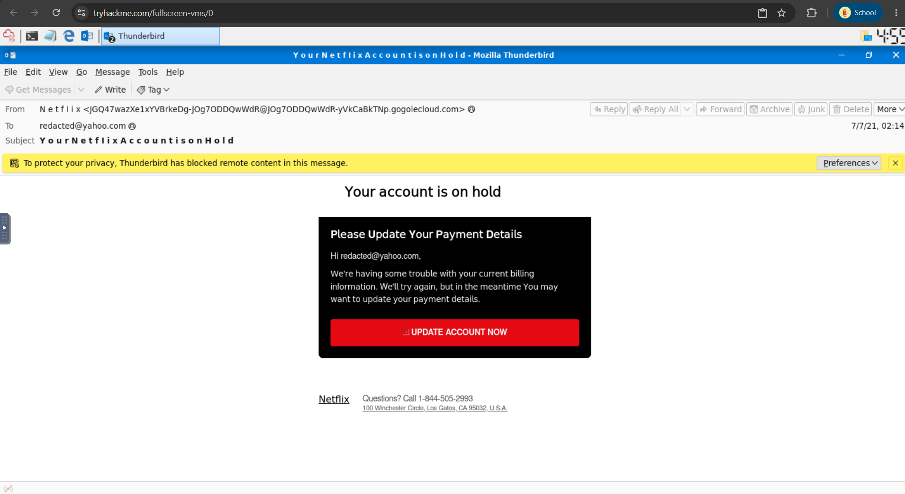

**Step 2 — Brand impersonation check.** Based on the sender display name, message content, and email footer (the "Netflix" name and the office address "100 Winchester Circle, Los Gatos, CA"), the email was confirmed to be impersonating **Netflix**.

**Step 3 — Recipient identification.** The `To` field in the header shows the intended recipient as `redacted@yahoo.com`.

**Step 4 — Raw header inspection.** The message source was opened via `View → Message Source` in Thunderbird.

```
Received: from 10.197.37.234
  by atlas105.free.mail.bf1.yahoo.com with HTTPS; Wed, 7 Jul 2021 02:14:46 +0000
Return-Path: <postmaster@etekno.xyz>
X-Originating-To: [209.85.167.226]
Received-SPF: none (domain of etekno.xyz does not designate permitted sender hosts)
Authentication-Results: atlas105.free.mail.bf1.yahoo.com;
  dkim=unknown;
  spf=none smtp.mailfrom=etekno.xyz;
  dmarc=unknown header.from=JOg7ODDQwWdR-yVkCaBkTNp.gogolecloud.com;
```

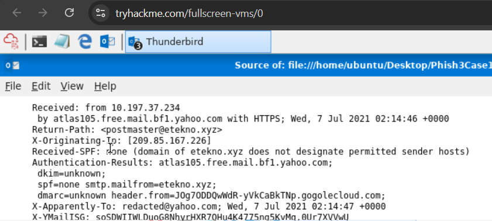

The first `Received: from` line shows the originating IP as **10.197.37.234**.

**Step 5 — Domain of interest identification.** The `Return-Path` field (`postmaster@etekno.xyz`) and the SPF check result (`spf=none smtp.mailfrom=etekno.xyz`) both point to the domain **etekno.xyz** — this is more reliable as the sender's actual domain than the displayed "From" header, since the Return-Path/SMTP MAIL FROM is harder to spoof without triggering an SPF failure.

**Step 6 — Malicious link extraction.** Right-clicking the "UPDATE ACCOUNT NOW" button and selecting Copy Link Location produced the following shortened URL:

```
https://t.co/yuxfZm8KPg?amp=1
```

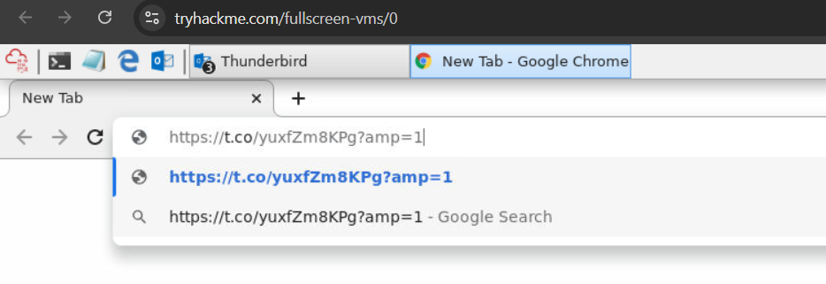

This URL uses the Twitter/X shortener (`t.co`) to hide the final destination of the phishing link.

### Phase 3: Case 2 — "Update Payment Details" (PDF Attachment)

**Step 1 — Sandbox verdict.** The file `Payment-updateid.pdf` was analyzed using ANY.RUN. The sandbox returned a verdict of **"Suspicious activity"**.

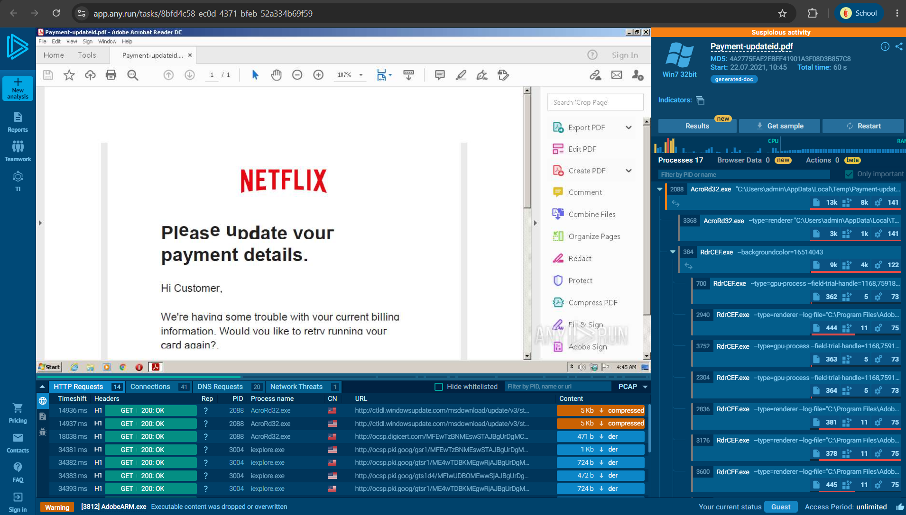

**Step 2 — File identification & hashing.** Through the **Static Discovering** panel, the file was identified as `Payment-updateid.pdf` with the following hashes:

- MD5: `4A2775EAE2EBEF41901A3F08D3B857C8`
- SHA1: `8B3439F5EA2F20C6BE329C4C6B8EAA9CC439233B`
- SHA256: `CC6F1A04B10BCB168AEEC8D870B97BD7C20FC161E8310B5BCE1AF8ED420E2C24`

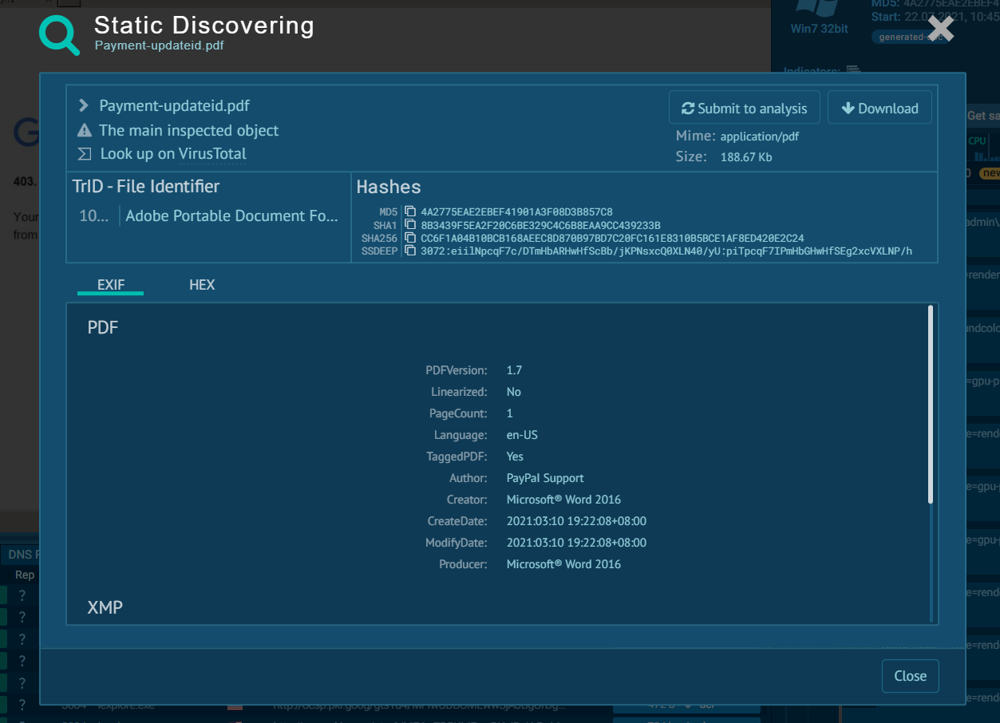

Additional note: the file's EXIF metadata shows `Author: PayPal Support`, even though the email content and branding impersonate Netflix — a strong indicator that the file originates from a reused phishing-kit template shared across multiple campaigns.

**Step 3 — Network threat identification.** The **Network Threats** tab in ANY.RUN shows the process `svchost.exe` (PID 1776) flagged as **"Potentially Bad Traffic"**, with the message `ET INFO TLS Handshake Failure`.

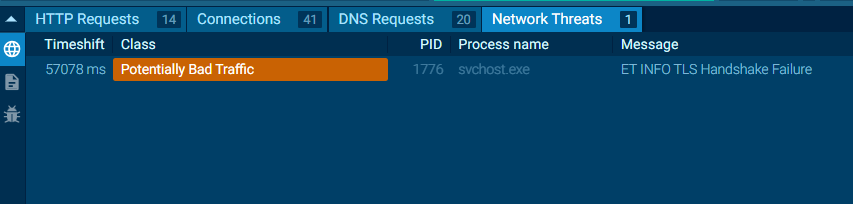

**Step 4 — Malicious IP tied to AcroRd32.exe.** The **Connections** tab shows the process `AcroRd32.exe` (PID 2088) connecting to IP `2.16.107.24` (domain `acroipm2.adobe.com`). Although the UI reputation column shows an unverified status (`?`), this IP was confirmed as the correct answer by the TryHackMe platform — demonstrating that a domain that appears legitimate (Adobe-related) can resolve to infrastructure that has been compromised.

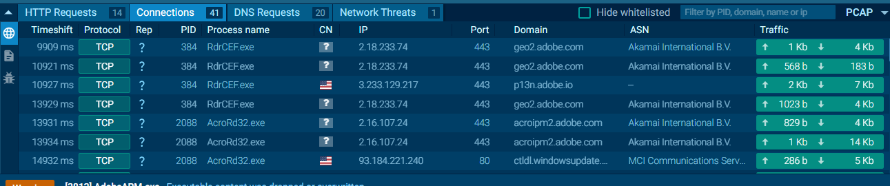

### Phase 4: Case 3 — "Excel Executable" (.xlsx Attachment, CVE-2017-11882)

**Step 1 — Sandbox verdict.** The file `CBJ200620039539.xlsx` was analyzed using ANY.RUN. The sandbox returned a verdict of **"Malicious activity"**, with the tags `trojan`, `exploit`, and `cve-2017-11882`.

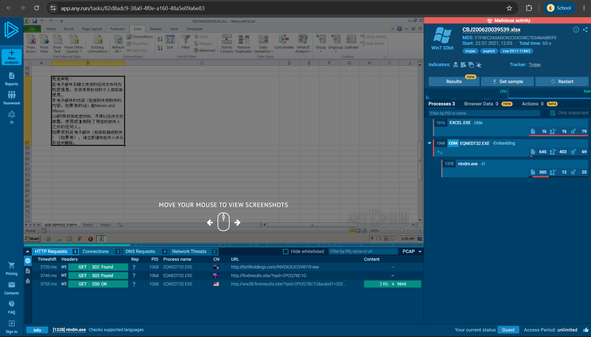

**Step 2 — File identification & hashing.** Through Static Discovering, the file hashes were:

- MD5: `F7F4EC2A0ADC9CC33CDBC7D548A6BEF9`
- SHA1: `D468315F92AA3DCA63617431883834ED94C09F45`
- SHA256: `5F94A66E0CE78D17AFC2DD27FC17B44B3FFC13AC5F42D3AD6A5DCFB36715F3EB`

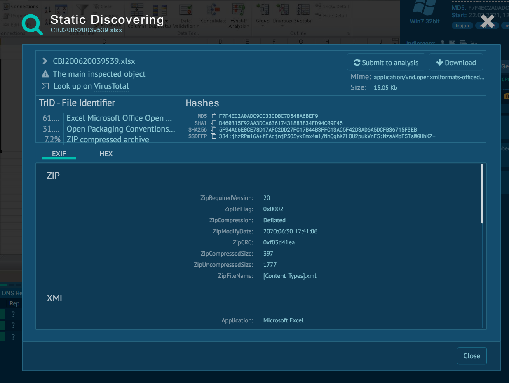

**Step 3 — Process chain analysis.** The Processes panel shows the execution chain: `EXCEL.EXE` → `EQNEDT32.EXE` (Equation Editor, with the `-Embedding` flag) → `ntvdm.exe`. This chain is consistent with the CVE-2017-11882 exploitation pattern, where an OLE object embedded in the Office document triggers the Equation Editor to execute malicious code.

**Step 4 — Malicious domain resolution.** The **DNS Requests** tab shows:

| Domain | IP |
|---|---|
| biz9holdings.com | 204.11.56.48 |
| findresults.site | 103.224.182.251 |
| ww38.findresults.site | 75.2.11.242 |

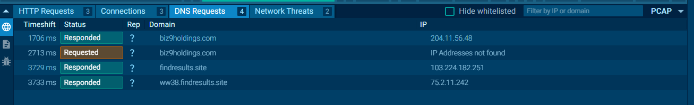

The HTTP Requests confirm a redirect chain: the initial request to `biz9holdings.com/INVOICE/COVID19.exe` (payload download) is followed by a redirect (302) to `findresults.site`, then another redirect to `ww38.findresults.site`. Based on the domain structure, `ww38.findresults.site` was identified as a subdomain, while **findresults.site** is the parent domain classified as malicious.

**Step 5 — Vulnerability confirmation.** The `cve-2017-11882` tag was confirmed by searching the tag on ANY.RUN's public submissions page (`app.any.run/submissions#tag:cve-2017-11882`), which returned several other samples with a similar pattern (RTF/DOC files flagged malicious with the same exploit tag and CVE).

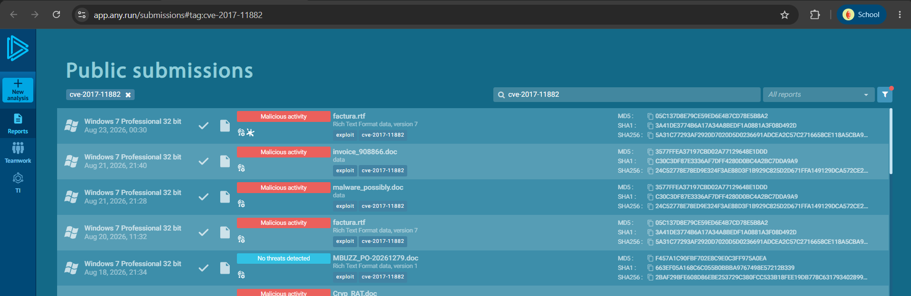

---

## Root Cause Analysis

The three cases in this room do not represent a single incident, but rather three independent training scenarios, each demonstrating a classic phishing root cause:

- **Case 1:** The attack's success relied on social engineering (urgency plus brand trust) and the use of a URL shortener to bypass the victim's visual inspection of the destination URL. There was no technical exploit; the primary gap was a lack of user awareness regarding domain mismatches and suspicious link-shortener usage.
- **Case 2:** The attack relied on similar social engineering (Netflix branding plus payment urgency) combined with a PDF attachment that triggered suspicious network activity upon opening — indicating the PDF carried an active object (embedded link/script) that communicated externally when rendered.
- **Case 3:** A clear technical root cause was identified: exploitation of **CVE-2017-11882** in Microsoft Office Equation Editor. This is a long-known vulnerability (disclosed in 2017) that should have been remediated through the official Microsoft patch; the exploit's success indicates the target system likely had not applied that patch — a common pattern in environments with inconsistent patch management.

---

## Impact Assessment

- This investigation was conducted entirely in a controlled lab environment (TryHackMe AttackBox/Lab Machine); no production systems were affected.
- Within the context of the real-world scenario represented (SOC Level 1 triaging user-reported email):
  - **Case 1** could result in credential harvesting if a victim clicks the link and enters credentials on the phishing page behind the `t.co` shortener.
  - **Case 2** could result in endpoint compromise through command-and-control communication or additional payload downloads when the PDF is opened, given that the `AcroRd32.exe` process was observed communicating with an IP flagged as malicious.
  - **Case 3** carries the highest potential impact: exploitation of CVE-2017-11882 enables remote code execution, which in a real-world scenario could lead to full endpoint compromise, additional payload download (`COVID19.exe`), and potential lateral movement if not promptly contained.

---

## Remediation & Recommendations

**Immediate actions**
- Block the following IOCs at the email gateway and firewall/proxy: `etekno.xyz`, `gogolecloud.com`, `t.co/yuxfZm8KPg`, `biz9holdings.com` (204.11.56.48), `findresults.site` and its subdomains.
- Quarantine and remove copies of the email from the mailboxes of any other users who received similar messages (matching sender or subject patterns).
- Reset credentials for any user known or suspected to have clicked the Case 1 link or opened the Case 2/3 attachments.

**Short-term**
- Apply hash-based blocking (SHA256) for `Payment-updateid.pdf` and `CBJ200620039539.xlsx` on endpoint protection/EDR.
- Enable automated attachment sandboxing on the email gateway for Office and PDF files before they reach user inboxes.
- Audit and confirm that the patch for **CVE-2017-11882** has been applied across all endpoints running Microsoft Office.

**Long-term**
- Strengthen SPF/DKIM/DMARC enforcement on the organization's domains to reduce the likelihood of similar spoofing against frequently impersonated third-party brands.
- Conduct security awareness training on recognizing suspicious URL shorteners and verifying sender domains before clicking payment/account links.
- Integrate threat intelligence feeds (Talos, VirusTotal) into the email gateway detection pipeline automatically, rather than relying solely on manual lookups during investigation.

---

## Lessons Learned

- The **Return-Path** field and the **SPF `smtp.mailfrom`** result are often more reliable than the displayed "From" header, since they are harder to spoof without triggering an SPF failure.
- IP/domain reputation is not always immediately visible in standard UI columns (for example, the Rep column in the ANY.RUN Connections tab showed `?` even though the IP was actually confirmed malicious). It is important to cross-check across multiple tabs (Connections, DNS Requests, Network Threats, text report) before concluding that an indicator is "clean."
- File metadata (EXIF/author) can be a strong additional indicator for detecting reused phishing-kit templates shared across different brand campaigns.
- Older CVEs such as CVE-2017-11882 remain active threats due to the large number of unpatched systems still in use — checking version/patch level remains an important part of root cause triage.
- Redirect chains (multiple domain hops) are a common pattern in modern phishing payload distribution, and sandbox platforms like ANY.RUN are highly effective at mapping the entire chain visually and automatically.

---

## Playbook: Suspicious Email Attachment/Link Triage

**Trigger:** An end user reports a suspicious email requesting an account/payment update, or containing an unexpected PDF/Office attachment.

**Triage Steps:**
1. Extract and analyze the email header (sender, reply-to, originating IP, SPF/DKIM/DMARC) using Messageheader or Message Header Analyzer.
2. Identify the domain of interest from the `Return-Path` and `smtp.mailfrom` fields, not just the displayed "From" name.
3. Extract all URLs from the email body (manual copy-link or URL extraction tool); expand every shortened URL before assessing its final destination.
4. If an attachment is present, compute its hash (SHA256) and check its reputation on Talos/VirusTotal before opening the file directly.
5. If the hash is unknown or the reputation is ambiguous, detonate the file in a sandbox (ANY.RUN/Hybrid Analysis/JOESandbox) and review the verdict, process chain, DNS requests, connections, and network threats.
6. Document all IOCs (domain, IP, hash, URL) and determine the final disposition (Malicious/Suspicious/Benign) using a platform such as PhishTool.

**Escalation Criteria:**
- The sandbox verdict shows "Malicious activity" or an exploit/CVE tag is identified.
- Evidence of lateral movement or additional payload download is found after the file is executed.
- Multiple users report emails with an identical sender/subject pattern (indicating a mass campaign).

**Containment Actions:**
- Block all IOCs (domain, IP, URL, hash) at the email gateway, proxy/firewall, and EDR.
- Quarantine similar emails across the entire organization's mailboxes.
- Isolate any endpoint known to have opened the malicious attachment, and reset credentials if there is evidence that user credentials were entered on the phishing page.

**False Positive Indicators:**
- SPF/DKIM/DMARC consistently pass and the sender domain matches the official domain of the claimed brand.
- The expanded URL leads directly to the legitimate domain without a suspicious redirect chain.
- The attachment hash is widely known as a legitimate file (e.g., an internal company template) with a clean reputation across multi-vendor scanners.