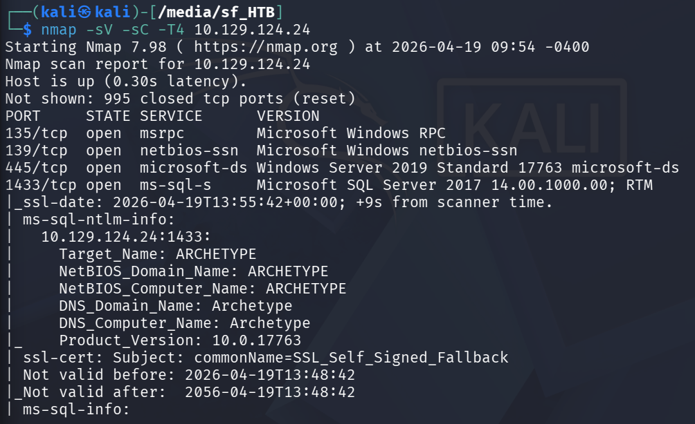

# [Archetype] — [SQL]

**Date:** 2025-04-19
**Platform:** HackTheBox
**Difficulty:** Very Easy
**Category:** OS 

---

## Target
Windows server dengan dua service utama yang terbuka: SMB lama (Port 139 Net BIOS)SMB modern (Port 445) dan Microsoft SQL server (Port 1433). Skenario kecerobohan menyimpan kredensial database di dalam file konfigurasi yang bisa diakses public melalui SMB share, lalu SQL server dikonfigurasi sedemikian rupa dengan fitur berbahaya yang memungkinkan eksekusi command windows langsung dari query SQL.

## Vulnerability
- SMB Missconfiguration - share backups bisa diakses tanpa autentikasi (anonymus/guest)
- Credentials in Config File - File prod.dtsConfig nyimpen username & password SQL server dalam plaintext dialam connection string
- xp_cmdshell abuse + powershell history - SQL server bisa dimanfaatkan untuk aktifin xp_cmdshell & jalanin command windows. Setelah masuk lalu cek powershell history dan terdapat kredensial administrator dalam plaintext

## Tools Used
- nmap - port scanning & service enumeration
- smbclient - SMB share enumeration & file download
- impacket-mssqlclient - koneksi ke microsoft sql server 
- python3 http.server - HTTP server untuk serve reverse shell script
- netcat (nc) - listener untuk nangkap reverse shell 
- powershell - reverse shell script di sisi target
- WinPEAS - windows privilege escalation enumeration
- impacket-psexec - remote login sebagai administrator 

## Exploitation Steps

### Step 1 — [Reconnaissance - Nmap scan]
Scan semua port untuk mengetahui port & service apa yang berjalan di target
```bash
# command yang kamu pakai
nmap -sV -sC target-ip
```
> 

### Step 2 — [Nama step, contoh: Finding the Vulnerability]
Jelaskan apa yang kamu temuin.
```
[output atau payload yang relevan]
```

### Step 3 — [Nama step, contoh: Exploitation]
Jelaskan cara eksploitnya.
```bash
# command eksploit
```

### Step 4 — [Nama step, contoh: Post Exploitation / Getting the Flag]
Apa yang kamu dapetin setelah berhasil masuk.

---

## Proof
```
Flag: THM{xxxxxxxxxxxx}
```
> [Screenshot flag/bukti akses]

---

## Lessons Learned
- Hal baru yang kamu pelajari dari challenge ini
- Kesalahan yang kamu buat dan gimana kamu benerin
- Apa yang mau kamu explore lebih lanjut setelah ini